```{r, include = FALSE}
knitr::opts_chunk$set(
  collapse = TRUE,
  comment = "#>"
)
```

```{css, echo=FALSE}
div, code {overflow-x:auto !important}
```

# Introduction: What is ShinyÉPICo for?

shinyÉPICo is a web application based on shiny and created to accelerate and to make easier the study of Illumina Infinium DNA methylation arrays, including the 450k and EPIC. For this purpose, shinyÉPICo uses, among others, the widely used minfi and limma packages for the array normalization and the differentially methylated positions (DMPs) calculation, respectively. Moreover, shinyÉPICo also supports differentially methylated regions calculation (DMRs), based on the mCSEA package.

It is intended as a 'graphical pipeline' since, throughout the analysis, you can observe the result of the different options with multiple charts, and interactively modify decisions in current or prior steps. In addition, the application automates calculations that would otherwise take much more time and effort.

shinyÉPICo is a fully graphical application and the calculations performed in R are done entirely on the server side. Therefore, the application can be used both on the local computer and through a web server, to which devices, such as computers, smartphones or tablets could be connected, without high RAM or CPU requirements.

The steps follow by the application includes the data importing, starting with iDAT files (Raw Illumina DNA methylation data), array normalization, quality control and data exploring, and DMP and DMR calculation. Each step has multiple options and charts that we will describe along this manual.

## What I need to use ShinyÉPICo? 

ShinyÉPICo can run in GNU/Linux, Windows or macOS. The package dependencies are automatically tried to install with the package install. You will need at least R 4.0 or higher. 

Since the application allows to follow interactively all the analysis process, many objects have to be stored in RAM memory. Therefore, the application can be memory demanding, especially when trying to analyze a large number of samples at the same time. We recommend at least 12GB of RAM for a smooth use of the application, but depending on the number of samples analyzed and whether they are EPIC or 450k, the needs may be lower or higher.

## How can I install it?

At the moment, you can install the application through github using the 'remotes' R package:

```{r eval=FALSE}
install.packages("remotes")
library("remotes")
install_github("omorante/shinyepico", upgrade="always")
```

## Dependencies and implementation

ShinyÉPICo implements internal functions to follow the array normalization, and the DMP/DMR calculations, including, for example, the beta values differential between the groups. For the main features of the application, the package dependencies are the following:

- Array reading and normalization: __minfi__
- Linear model generation and DMP calculation: __limma__
- DMR calculation and genomic graph: __mCSEA__
- Heatmaps: __gplots::heatmap.2__ and __heatmaply__
- Other charts: __ggplot2__ and __plotly__

In particular, the complete dependences of the application are:

    R (>= 4.0.0),
    DT (>= 0.15.0),
    IlluminaHumanMethylation450kanno.ilmn12.hg19,
    IlluminaHumanMethylation450kmanifest,
    IlluminaHumanMethylationEPICanno.ilm10b4.hg19,
    IlluminaHumanMethylationEPICmanifest,
    data.table (>= 1.13.0),
    doParallel (>= 1.0.0),
    dplyr (>= 1.0.0),
    foreach (>= 1.5.0),
    GenomicRanges (>= 1.38.0),
    ggplot2 (>= 3.3.0),
    gplots (>= 3.0.0),
    heatmaply (>= 1.1.0),
    limma (>= 3.42.0),
    minfi (>= 1.32.0),
    plotly (>= 4.9.2),
    reshape2 (>= 1.4.0),
    rlang (>= 0.4.0),
    rmarkdown (>= 2.3.0),
    rtracklayer (>= 1.46.0),
    shiny (>= 1.5.0),
    shinyWidgets (>= 0.5.0),
    shinycssloaders (>= 0.3.0),
    shinyjs (>= 1.1.0),
    shinythemes (>= 1.1.0),
    statmod (>= 1.4.0),
    tidyr (>= 1.1.0),
    zip (>= 2.1.0)

For the DMR calculation, additional suggested packages are required. You can use the application without installing this package, but you will not able to calculate DMRs.

    mCSEA (>= 1.10.0)

And, to run the application: 
```{r eval=FALSE}
library("shinyepico")
run_shinyepico()
```

The function run_shinyepico has 5 parameters that can be modified:

* **n_cores:** The application is partially compatible with parallel computing. This numeric parameter controls the number of cores and, by default, it is half of the detected cores. If you have limited RAM memory (8GB or less) we recommend to set this to 1, in order to avoid the RAM overhead of multicore calculations.
* **max_upload_size:** By default, shiny applications have an upload limit (in MB), useful when the application is running in a web server. By default, this parameter is 2000MB.
* **host:** IP used to deploy the application. By default, this parameter is your local IP (127.0.0.1) which means that only you, from your computer, will have access to the application. However, it is possible to make the app reachable to other computers in the same LAN changing the IP to 0.0.0.0.
* **port:** Port used to deploy the application. By default, a random free port.
* **seed:** Seed used to make the calculations reproducible. By default, 123. If you do not want to use a seed, you should set this parameter to NULL. Particularly, DMRs calculation, thay rely on the mCSEA package, utilizes permutations to estimate the p.value. For that reason, some uncertainty is expected, and results can be a bit different every time you run the application. Using a seed avoid this problem, as you will obtain always the same result with the same seed.


# ShinyÉPICo workflow

shinyÉPICO workflow is divided in tabs that summarize the different steps to follow:

* **Data import**
* **Quality control and array normalization**
* **Differentially Methylated Positions calculation**
* **Differentially Methylated Regions calculation**
* **Data export**

While it is possible to go back to previous steps and change options at any point in the process, some buttons are disabled until the steps to be able to perform them are completed. For example, you will not be able to generate a heatmap if you do not complete the normalization of the arrays and the calculation of the DMPs.

In the next sections, we will discuss the different steps, the options, and chart interpretation. Moreover, we will use a public DNA methylation array dataset to show an example of application use.

# Using ShinyÉPICO: an explanation of the options and an example with real data

In this example, iDATs from xxx paper will be used to illustrate the steps. Although shinyÉPICo can be used with multiple groups and large cohorts, and in that case, iteration and automation is more useful, for this manual we have decided to use a minimal example that can be easily reproduced on almost any computer. Specifically, monocyte and monocyte-derived macrophages (produced with M-CSF) has been selected, only 6 samples (3 monocyte samples and 3 macrophage samples from 3 different healthy donors).

The .zip file of this dataset can be found in the "example_data" folder of the GitHub project. (Li_NAR_2019.zip) (AÑADIR ENLACE)

## Data Import and Sample Selection

The first step in the shinyÉPICo workflow is prepare the data in the properly format. iDAT files should be compressed in a .zip file. The name of the files should follow the standard convention: **XXXXXXXXXXXX_YYYYYY_ZZZ.idat** being XXXXXXXXXXXX the Sentrix_ID, YYYYYY the Sentrix_Position and ZZZ Grn or Red (corresponding, respectively, to the Red and Green signal file).

Moreover, a CSV (comma-separated) file with the annotation of the experiment should be included. It is mandatory to include the Sentrix_ID and Sentrix_Position columns that allows the software to find their respective iDAT files. Moreover, other columns should be added to reflect the different variables (e.g. sample name, health/disease, treatment/control, age, sex, hybridization day, etc.). Usually, iDATs and sample sheet are obtained meeting these features by default, and no additional work is required.

In this regard, 3 parameters are required in the Input tab to continue the analysis:

* A column with the **sample names**, that should be unique, without duplicates.
* A column with the **variable of interest**, in which sample groups will be found to calculate DMPs and DMRs.
* Optionally, a **donor variable** is also included in the Input tab. If you have an experiment where several samples come from the same donor, it is recommended to add a column with this information and select it in the form. This information is used in the SNPs heatmap of the Normalization section (as we will discussed later), and also for the DMPs/DMR calculation. If you select a valid donor variable, this information is automatically aded as covariable of the linear model in the DMPs section, and, therefore a "paired analysis" will be performed. If you do not have or you would not like to use this information, you can select the same column than sample names.

One aspect to take into account is that shinyÉPICo autodetects the variable types (numerical or categorical) depending on whether or not they can be coerced to numbers. For this purpose, variables are coerced to a numeric vector, and when the generated NAs are less than 75% of the total, the variable is set as numeric, and, otherwise, as categorical. Moreover, not informative categorical variables are excluded (e.g., a variable with the same value in all the samples, or with not equal values). Therefore, numbers should not be used for categorical variables in the sample sheet. Numerical variables with some NAs but less than 75% can be used in the exploratory analysis but not as covariables of the linear model, since Limma needs a design matrix without missing values.


In the next table, you can see the sample sheet of the example dataset:

```{r, echo=FALSE, eval=FALSE}
knitr::kable(read.csv("../example_data/Sample_Sheet.csv"))
```

It includes the Sentrix_ID and Sentrix_Position mandatory columns, and also other columns relevant for the experiment such as Sample_name, Sample_group and donor. 

After selecting the proper column in each form field, and the samples to be included (in this example, all), it is possible to proceed with the next step, pressing the "Continue" button. When the application is performing an operation expected to be long, a progress bar is displayed at the bottom right of the window to inform the user that the application is busy.

Internally, shinyÉPICO uses the "read.metharray.sheet" and "read.metharray.exp" functions to read the sample sheet and to load the DNA methylation data, respectively. Using the minfi recommended value, the genomic positions of the final obtained RGChannelSet object (Raw Data) obtained with the "read.metharray.exp" function are filtered by the detection p.value, removing all the positions with an average p.value higher of 0.01 (link to detectionP function).

(insertar imagen input)


After loading the methylation data of the selected samples, the Normalization tab is automatically shown, where you can see an overview of the data quality and perform the array normalization.

## Quality control charts
First, the quality control tab shows two useful charts to identify bad samples.

On the one hand, the **QC Signal plot** shows the median methylated (mMed) and umethylated (uMed) of each sample array. When mMed or uMed of a sample is less than 10, it is considered "Suboptimal". Although this cutoff is arbitrary and it is the user who decides whether a sample is valid or not, a signal much lower than this threshold or very different from most samples indicates that there has been a problem with it. Depending on whether the signal is very far from this threshold and depending on the rest of results, these types of samples should be excluded from the analysis. To exclude samples, you can go back to the Input tab to change the samples selected and load them again.

On the other hand, the **Bisulfite conversion plot** is calculated using information of the bisulfite conversion II control probes of the 450k/EPIC arrays. When the bisulfite conversion reaction is successful, the probe of the control position will have intensity in the Red channel, whereas if the sample has unconverted DNA, the probe will have high signal in the Green channel. 

For each sample, we calculate all the Red/Green ratios for each control position, and the minimum ratio is shown in the chart. When a sample has a ratio lower than 1.5, we flag it as "Failed".


## Array Normalization

A correct array normalization is essential for the results of the subsequent steps in the workflow. shinyÉPICo can use all the normalization methods available in the minfi package:

- __Raw__ (without normalization)
- __Illumina__ (a reverse-engineered implementation of the Genome Studio normalization)
- __Funnorm__ (a between-array normalization method that rely in data from control probes of the arrays. It performs also Noob normalization before the Functional Normalization.)
- __Noob__ (a within-array normalization method with dye-bias normalization.)
- __SWAN__ (a within-array normalization method that allow Infinium I and Infinium II probes to be normalized together.)
- __Quantile__ (a between-array normalization method that assume no global differences in methylation between the samples. When global changes are expected, such as in cancer samples, other methods, such as Funnorm, are recommended.)
- Additionally, it offers the option of performing Noob within array normalization followed by Quantile normalization (**Noob + Quantile**), analogously to the Funnorm method. This non-standard approach has empirically shown good results in our experience.

For details about the methods, the minfi documentation and the respective publications are very good references. Although depending on the experimental design and the type of changes expected a normalization method can be expected to be better than another, usually the best method should be determined empirically among the valid options.

Additionally, shinyÉPICo offers three more options in the Normalization tab:

* **Drop CpHs**: When this option is selected, CH probes (non-CpG methylation) are removed. It uses the minfi::dropMethylationLoci function with standard parameters.
* **Drop SNPs**: When this option is selected, positions with SNPs annotated by Illumina are removed, with a MAF (minimum allele frequency) higher than the cutoff selected are removed. It uses the minfi::dropLociwithSnps function with standard parameters.
* **Drop X/Y Chr**: When this option is selected, all the positions of the sex chromosomes are removed. Since the methylation values of these chromosomes can be very different depending on the sex of the donors, removing them can help to homogenize the data. However, alternatively, sex information can be added to the linear model. 

shinyÉPICo makes very simple to test different methods. When a normalization method is selected, clicking the "Select" button, the different charts are automatically generated. 

In this example, we are going to select the Quantile normalization. We show different examples of the type of charts generated by the software.

### Density plot

This chart shows the distribution of beta values of every sample. A bimodal distribution is expected, with two peaks centered around 0 (unmethylated) and 1 (methylated) beta values. When more peaks are shown in the middle, or when the pattern of different samples is very different, it indicates problems in some step of the sample preparation or hybridization.  After normalization, we expect an improved alignment of the sample patterns, with little discrepancies between them.

__Raw:__

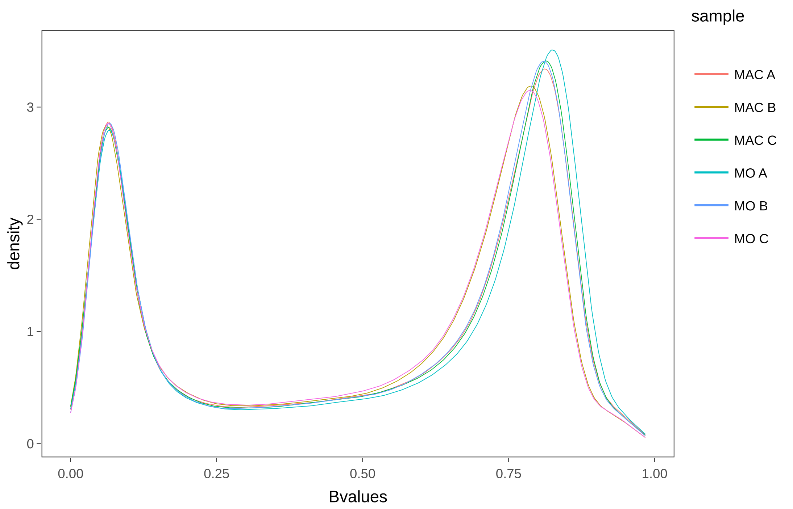

__Quantile:__

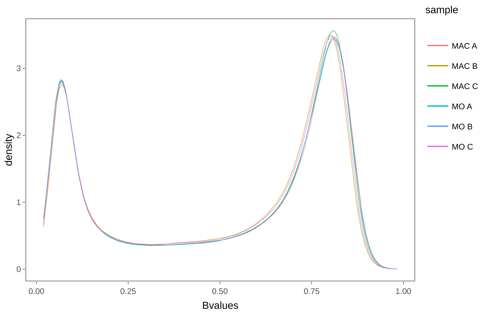

### Boxplot

This chart shows the box-and-whisker plot of beta values in each sample. The median and interquartile range of the samples should be similar, and more homogeneous after the normalization. 

__Raw:__
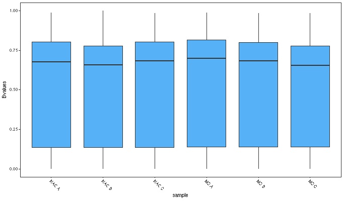{width=90%}


__Quantile:__
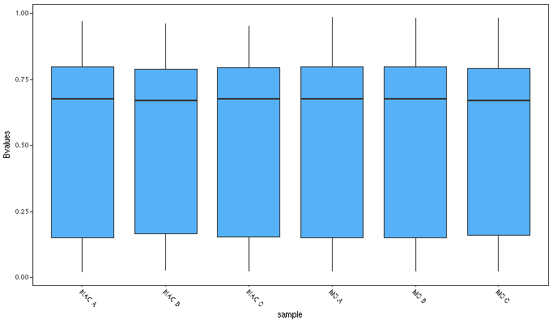{width=90%}


### SNPs heatmap

This heatmap utilizes information of an special subset of single nucleotide polymorphism (SNP) probes in the 450k and EPIC arrays. For the representation, we use the beta values of these probes (extracted using the function minfi::getSnpBeta()). The heatmap shows a column clustering, that should correspond with the donor information. For example, in this experiment, with 3 different treatments and 3 donors, we can see a clear clustering by donor.

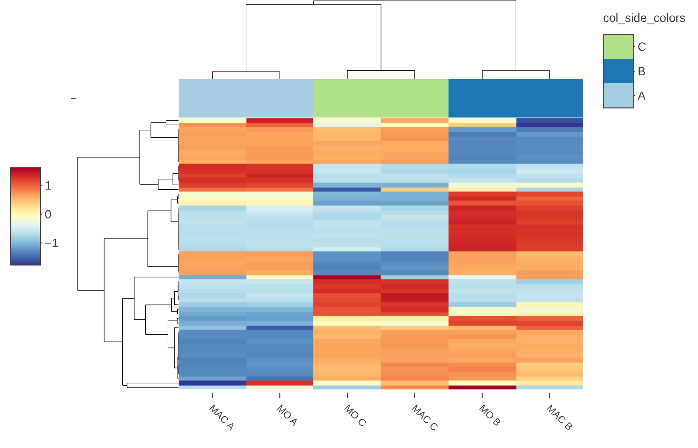


### Sex prediction

Depending on the median X and Y chromosomes intensities, we show the sex prediction generated with the function minfi::getSex(). Note that, even if the Drop X/Y Chr. option is selected, this prediction is done before that step, and this graph will not be altered.

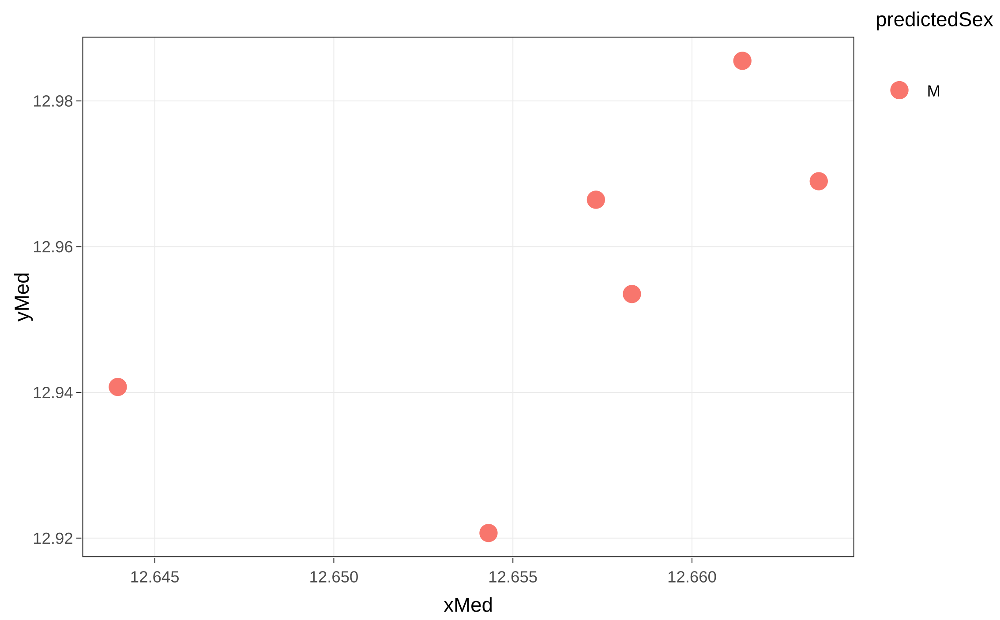

### Exploratory analysis: PCA and Correlations

In order to get a first overview of the data before the DMP/DMR calculation, we provide two more charts.

* **PCA:**

First, we show the principal component analysis (PCA). Selecting specific principal components to plot in the x and y axis is possible, as well as changing the color variable. Moreover, a table showing the percentage of variance explained in each principal component is also depicted.

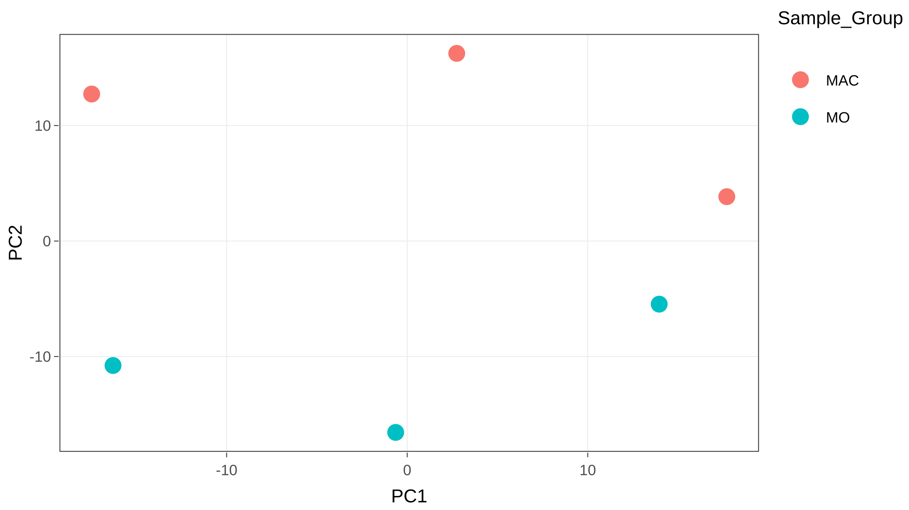

* **Correlations:**

Secondly, we also provide a heatmap of the correlations between principal components and variables. As we explained before, variable types (categorical or numerical) are guessed, and not informative variables are excluded. 

In the correlations tab, a detailed table of the variables is shown, including the type (categorical variables are shown as "factor", numerical variables as "numeric", and discarded variables as "discarded"). 

Pearson correlation is applied to correlate principal components with numerical variables. For categorical variables, linear models (principal component ~ categorical variable) are generated and R-squared statistics are shown in the representation. Alternatively, the p.values associated with these statistical approaches can also be plotted in a heatmap. 

Both PCA and correlations plots can be also useful to find possible variables affecting methylation data, in order to select covariates and interactions for DMP/DMR calculation.


__Correlation value:__

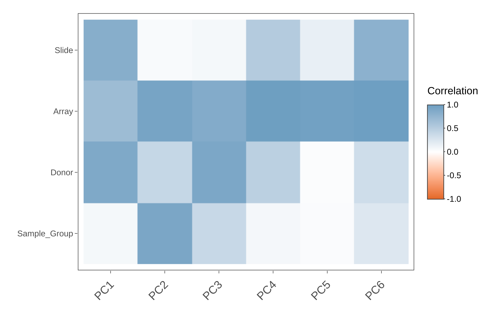
__P value:__

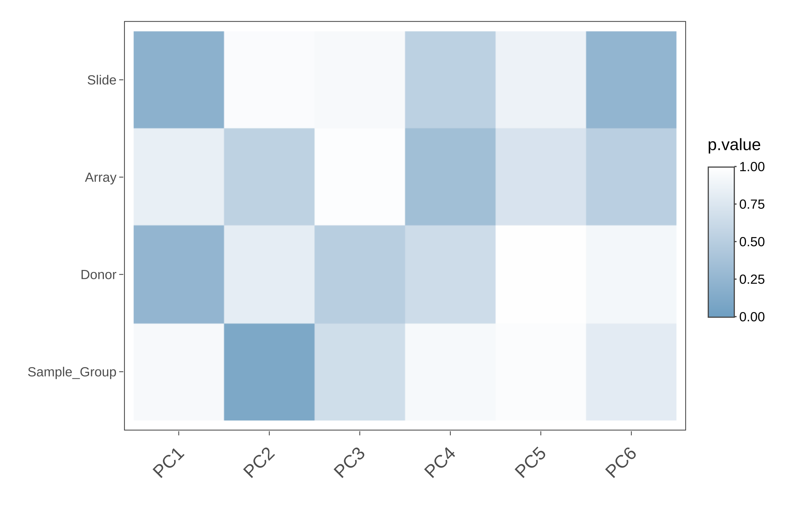

## Differentially Methylated Positions (DMP) calculation

After normalizing the methylation data, the next tab, "DMPs", will become enable. The process of DMP calculation is divided in two parts: model generation and contrasts calculation.

### Model generation

In order to calculate DMPs between groups of the variable of interest, shinyÉPICo uses the limma package (CITA). First, shinyÉPICo fits a linear model using the __M values__, with the limma::lmFit function.

Beta values are used in all the charts of the application, because of its easier biological interpretation: Beta values range from 0 (totally unmethylated) to 1 (totally methylated). 

However, for the statistical analysis with Limma, shinyÉPICo utilizes the M values (calculated as the logit of Beta values). M values range from -Infinite to Infinite.

Beta values are not as suitable to use with limma, because they have severe heteroscedasticity for highly methylated or unmethylated positions. For that reason, M values (homoscedastic data) are used for the limma model, whereas Beta values are used for representation. (https://bmcbioinformatics.biomedcentral.com/articles/10.1186/1471-2105-11-587)

https://bioconductor.org/packages/devel/bioc/vignettes/limma/inst/doc/usersguide.pdf

Several options can be set in this step:
* **Variable of interest**: This variable, that should be categorical, will be used to perform the contrasts to generate the DMPs.
* **Linear model covariables**: When other variables different from the variable of interest can be influencing the DNA methylation differences, they can be included in the linear model. Limma will take into account these differences and correct them in the result. For example, DNA methylation is very dependent on the donor, and, in experiments with several samples of the same donor, generally is recommendable to add the donor as covariable. If you have selected a donor covariable in the Input tab, this option will be selected by default. 
* **Linear model interactions**: When you suspect that a variable can be affecting DNA methylation depending on another variable (for example, changes of DNA methylation between sex that are specific of age), an interaction term can be added to the model.
* **Array Weights**: If this option is enabled, estimated relative quality weights for each array are calculated and used in the limma model, using the function limma::arrayWeights. This option ponderates the influence of the arrays in the model depending on the calculated qualities. It is especially useful with large datasets of heterogeneous quality. Ritchie et al (2006)

### Contrasts calculation

ShinyÉPICo autodetects all the possible comparisons between the groups found in the variable of interest. The number of pairwise combinations between the different groups are calculated as follows: n! / (2! (n ― 2)!), where n is the number of groups.

Then, the application iterates over the contrasts and calculates the tables with the statistics produced by limma, using the functions limma::contrasts.fit, limma::eBayes and limma::topTable. Two more options can be set in this section:

* **eBayes Trend**:
* **eBayes Robust**:

Moreover, shinyÉPICo also calculates the differential of betas between groups, for each position. This information will be used in next steps.

### Heatmap customization

shinyÉPICo provides plenty of options to filter the statistics produced by limma and to generate a custom heatmap.

***Filtering options***

* **Min. DeltaBeta**: The threshold of the minimum differential of beta values between groups. By default, this value is 0.2.
* **Max. FDR**:  The threshold of the maximum false discovery rate (adjusted p value). By default, this value is 0.05.
* **Max. p-value**: The threshold of the maximum unadjusted p value. By default, this value is 1.

With this options, a summary table with the DMPs found in each contrast is shown. In this example:

```{r, echo=FALSE, eval=TRUE}
knitr::kable(data.frame(contrast = "MAC-MO", Hypermethylated=2272, Hypomethylated=21, total=2293))
```

The differential of beta is always calculated as the subtract of the average value from the first group to the second group (in this example, MOavg - MACavg) and the positions are assigned to the "Hypermethylated" group if the differential is greater than 0, and to the "Hypomethylated" group if the differential is lower than 0. 

***Group options***

* **Groups to plot**: Groups to be shown in the heatmap. When the column dendrogram is disabled, the order of the samples follows the order in this parameter. Drag and drop is enabled to reorder the groups in the form.

* **Contrasts to plot**: DMPs from the contrasts selected in this parameter are shown in the heatmap. Since several contrasts can share common DMPs, the heatmap shows only these common DMPs once, without duplicates.

***Data options***

* **Remove Batch Effect**: If this option is enabled, Beta values are modified with the function limma::removeBatchEffect and the information provided of covariables and interactions and the heatmap is generated with these values. For representation, this option can help to see a more clear pattern when technical variables, such as hybridization time, are affecting the results. Note that these corrected beta values are not used for any statistical test, and this option does not affect to the differential of beta calculation neither. 

***Clustering options***

* **Clustering algorithm**: Clustering algorithm to be passed to the hclust function. It includes single, average, complete, mcquitty, median and centroid algorithms. By default, it is average.
* **Distance Function**: Distance function to be used for the clustering. It can be Pearson correlation, Spearman correlation, Kendall or Euclidean. Whereas Pearson/Spearman correlation usually are useful distances when the scaling is performed, Kendall or Euclidean distance are more suitable when the heatmap is not scaled.
* **Scale**: This option indicates if scaling of the date should be performed. By default, a scaling of the data by row (position) is applied. 

***Additional options***

* **Static Graph**: If this options is enabled (it is by default), the heatmap is plotted using the function gplots::heatmap.2 that produces a static image. If the option is disabled, the heatmap is plotted with the function heatmaply::heatmaply, which is less eficient and slower, but produce an interactive chart.
* **Column Dendro.**: This option indicates if columns (samples) should be ordered by the dendrogram (the default option) or if the columns should be ordered by group. 
* **Column Colors**: When this option is enabled, a color legend of the different groups is shown above each column.
* **Row Colors**: When this option is enabled, row dendrogram is divided in the number of grupos selected (k number) using the stats::cutree function. The resulting clusters are shown in different colors next to the row dendrogram.

Since heatmap plotting can be very time- and memory- consuming, we have fixed a limitation of 12.000 positions (rows) in the heatmap. If you try to plot more positions, you will see a message with this information. However, if you need a bigger heatmap, you can download the information to generate it in the Export tab, as we will discuss later.


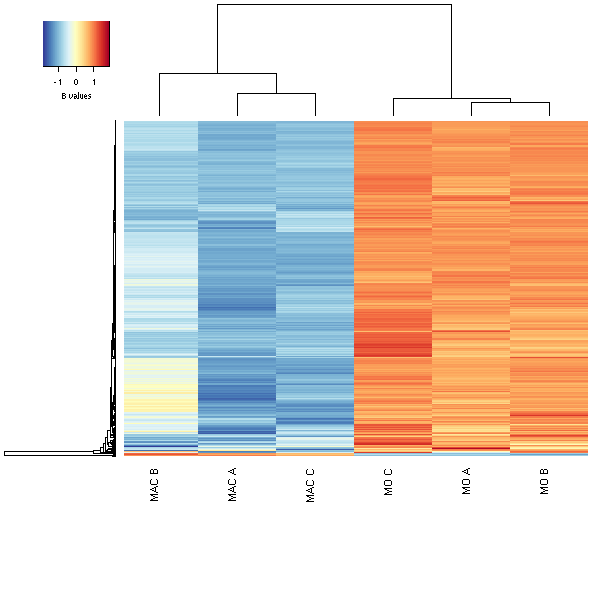

### DMPs Annotation

In the next tab of the DMPs section, DMPs annotation, the information about the genes associated with the DMPs is provided in a table. Moreover, the boxplot of a selected position can be plotted.

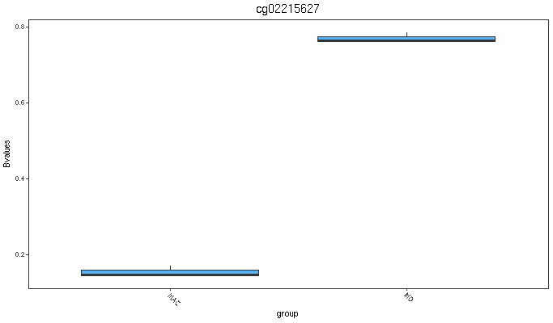

The information of the table can be downloaded in CSV or XLSX (Excel) formats, using the buttons above it. However, only rows shown can be downloaded. It is necessary to display all the information in order to download it.


## Differentially Methylated Regions (DMR) calculation

In addition to DMP calculation, shinyÉPICO also supports DMR calculation. A DMR is defined as a genomic region with differential methylation between groups. Instead of checking individual changes in genomic positions, DMR calculation involves the comparison of groups of genomic positions, which can be clusterized by several ways depending on the specific algorithm used.

DMR calculation of shinyÉPICO is based on the package mCSEA (CITA) which search DMRs in predefined regions: promoters, gene bodies and CpG islands.

mCSEA uses an algorithm based on the gene set enrichment analysis ((Subramanian et al., 2005). Instead of genes, mCSEA uses a sorted list of genomic positions compared between two conditions.

Therefore, we use the eBayes result of limma of each contrast, sorted by the t-statistic, as input of mCSEA. This implies that the parameters introduced in the limma model, including variables and covariates, are also taken into account for the calculation of DMRs, without the need of additional calculations.


### mCSEA options

In the DMRs tab, some options can be set for the calculation generated by the mCSEA package:

* **Contrasts to calculate**: From all the contrasts possible for your variable of interest, you can select an specific subset.
* **Type of DMRs**: Among the three types of predefined genomic regions, you can select an specific subset.
* **Array platform**: Since the predefined genomic regions are dependent on the DNA methylation array used (450k or EPIC), you can select here the correct option. By default, this parameter is autodetected and set based on the input data.
* **Min. CpGs in DMR**: This parameter is a cutoff, that indicates the application to remove all the genomic regions with less positions than the minimum indicated.
* **Number of permutations**: mCSEA relies on permutations to estimate the p.values. Therefore, a higher permutation number will produce a more accurate result, but it would be more computationally demanding. 


### Heatmap customization

In the DMR section, shinyÉPICo provides the same options to filter the data and customize the data than in the DMP section, with some adaptations.

***Filtering options***

* **Min. DeltaBeta**: The threshold of the minimum differential of beta values between groups. By default, this value is 0.
* **Max. FDR**:  The threshold of the maximum false discovery rate (adjusted p value). By default, this value is 0.05.
* **Max. p-value**: The threshold of the maximum unadjusted p value. By default, this value is 1.

With this options, a summary table with the DMRs found in each contrast is shown. In this example:
```{r, echo=FALSE, eval=TRUE}
knitr::kable(data.frame(contrast = rep("MAC-MO",3), Hypermethylated=c(54,112,48), Hypomethylated=c(76,95,56),total=c(130,207,104)))
```

In order to calculate the differential of beta for DMRs, all the positions in DMRs are considered. The differential of beta is always calculated as the subtract of the average value from the first group to the second group (in this example, MOavg - MACavg) and the positions are assigned to the "Hypermethylated" group if the differential is greater than 0, and to the "Hypomethylated" group if the differential is lower than 0. 

***Group options***

* **Groups to plot**: Groups to be shown in the heatmap. When the column dendrogram is disabled, the order of the samples follows the order in this parameter. Drag and drop is enabled to reorder the groups in the form.

* **Contrasts to plot**: DMPs from the contrasts selected in this parameter are shown in the heatmap. Since several contrasts can share common DMPs, the heatmap shows only these common DMPs once, without duplicates.

* **Regions to plot**: DMPs from the type of DMRs selected in this parameter are shown in the heatmap.

***Data options***

* **Remove Batch Effect**: If this option is enabled, Beta values are modified with the function limma::removeBatchEffect and the information provided of covariables and interactions and the heatmap is generated with these values. For representation, this option can help to see a more clear pattern when technical variables, such as hybridization time, are affecting the results. Note that these corrected beta values are not used for any statistical test, and this option does not affect to the differential of beta calculation neither. 

***Clustering options***

* **Clustering algorithm**: Clustering algorithm to be passed to the hclust function. It includes single, average, complete, mcquitty, median and centroid algorithms. By default, it is average.
* **Distance Function**: Distance function to be used for the clustering. It can be Pearson correlation, Spearman correlation, Kendall or Euclidean. Whereas Pearson/Spearman correlation usually are useful distances when the scaling is performed, Kendall or Euclidean distance are more suitable when the heatmap is not scaled.
* **Scale**: This option indicates if scaling of the date should be performed. By default, a scaling of the data by row (position) is applied. 

***Additional options***

* **Static Graph**: If this options is enabled (it is by default), the heatmap is plotted using the function gplots::heatmap.2 that produces a static image. If the option is disabled, the heatmap is plotted with the function heatmaply::heatmaply, which is less eficient and slower, but produce an interactive chart.
* **Column Dendro.**: This option indicates if columns (samples) should be ordered by the dendrogram (the default option) or if the columns should be ordered by group. 
* **Column Colors**: When this option is enabled, a color legend of the different groups is shown above each column.
* **Row Colors**: When this option is enabled, row dendrogram is divided in the number of grupos selected (k number) using the stats::cutree function. The resulting clusters are shown in different colors next to the row dendrogram.

Since heatmap plotting can be very time- and memory- consuming, we have fixed a limitation of 12.000 positions (rows) in the heatmap. If you try to plot more positions, you will see a message with this information. However, if you need a bigger heatmap, you can download the information to generate it in the Export tab, as we will discuss later.


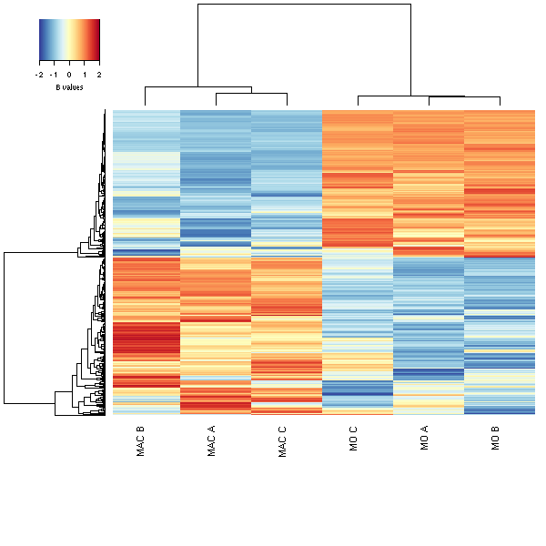
### Single DMR plot

In the Single DMR plot tab, a table with the DMRs of a selected contrast and region is shown. A DMR can be selected to be plotted in its genomic context. 
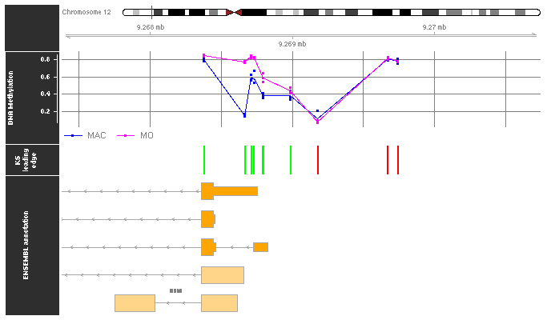


## Exporting results

blablabla

### R Objects

### Filtered bed files

### Workflow report

### Custom R Script

### Heatmap(s)


# References

# Session info

```{r echo=FALSE}
sessionInfo()
```

